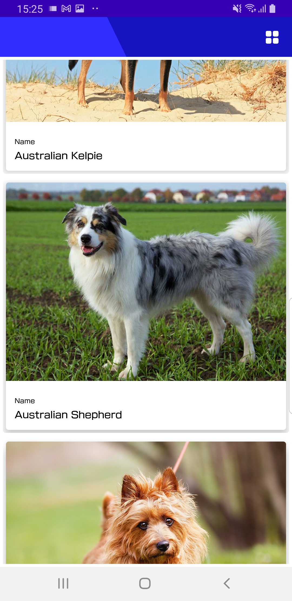
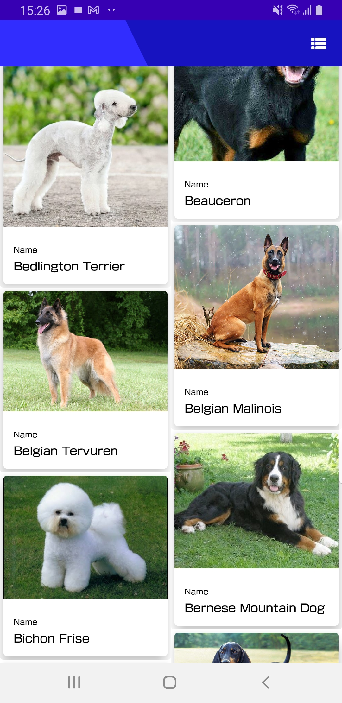
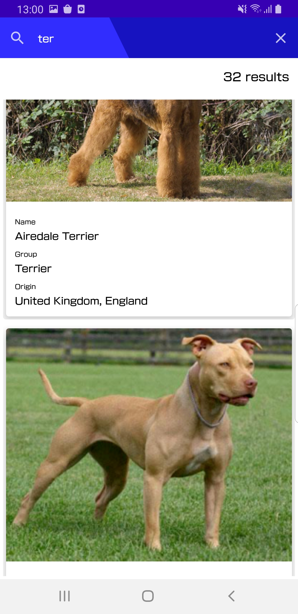

# Fenrir-Friends
App that allows the user to view dog breads, search for specific dog breed and take a look into their details

## The Brief

The app get data from the [the Dog api](https://thedogapi.com/).
It showns the data using pagination and caches data in order to support offline mode.
The app is ready for multiple screen sizes and dark mode

It uses a clean achitecture (divided by layer) and MVI

## Architecture & Libraries
    - MVI
    - Retrofit
    - ROOM Database
    - Dependency Injection - Dagger-Hilt
    - Kotlin Coroutines
    - Offline Cache
    - Flow
    - Paging 3
    - Coil
    
## App preview:

Image #1            |                Image #2                 |  Image #3
:-------------------------:|:---------------------------------------:|:----------------------------:
    |  |   

